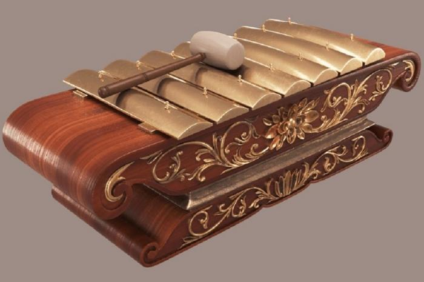
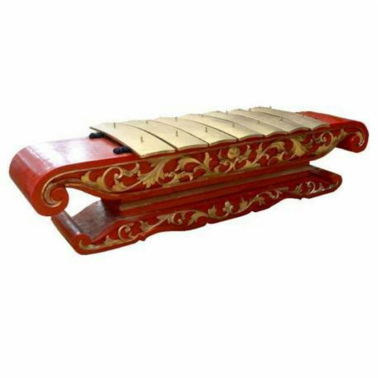
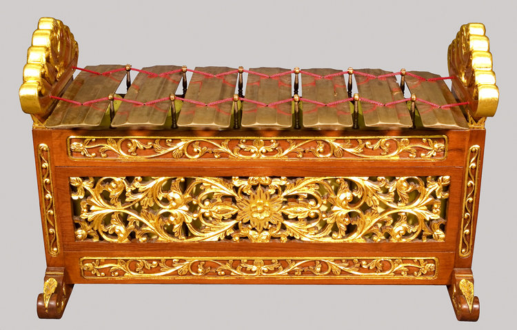
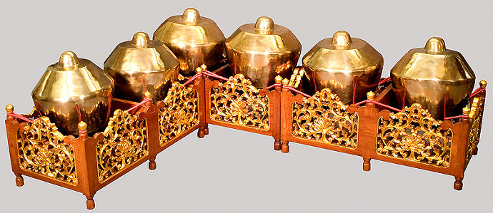
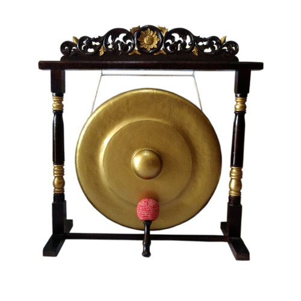
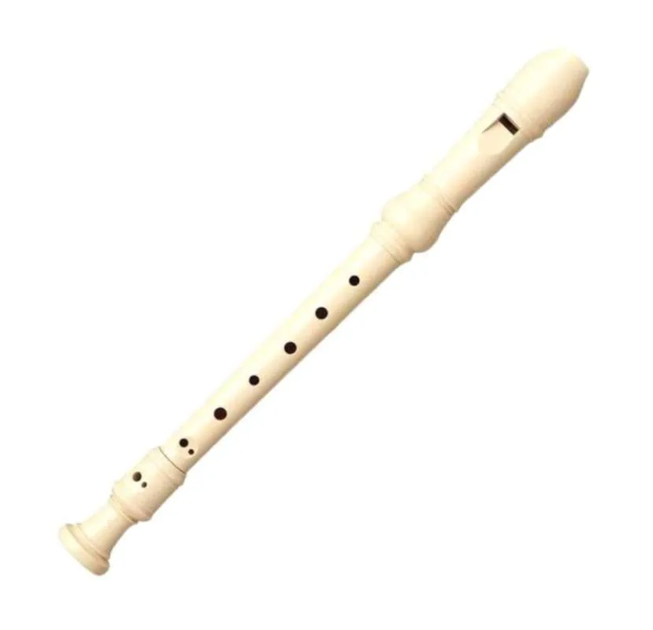
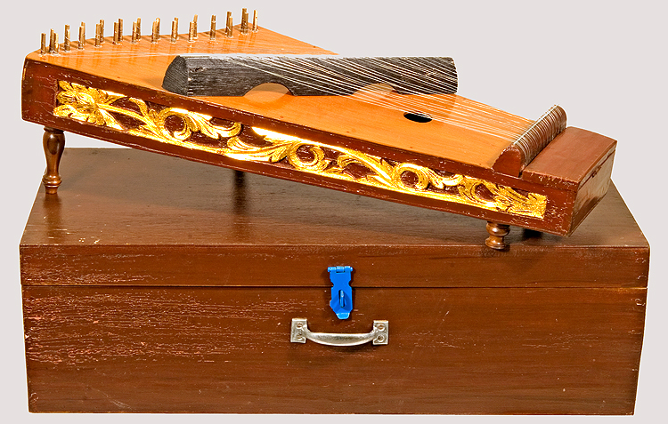
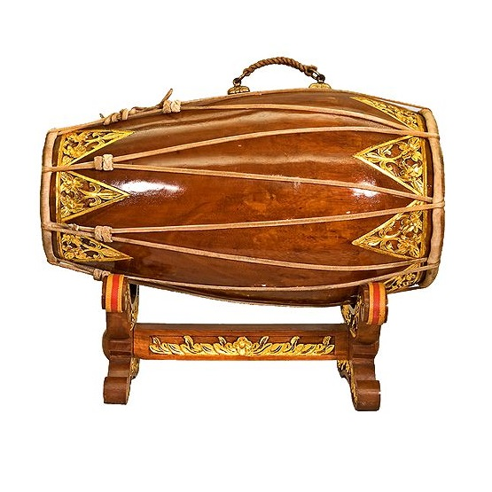

<!DOCTYPE html>
<html lang="id">
<head>
    <meta charset="UTF-8">
    <meta name="viewport" content="width=device-width, initial-scale=1.0">
    <title>SAMPLE AUDIO GAMELAN</title>
    <link rel="stylesheet" href="ini.css">
</head>
<body>
    

        

            <h2>1. SARON</h2>
            
            
Saron (Javanese: ꦱꦫꦺꦴꦤ꧀) is a gamelan instrument in the form of metal keys placed on a hollow wooden case, the number of keys is as many as the main tone of the scale, between 6 to 7 keys (some up to 9 keys). The lowest-pitched saron is called demung or saron panembung, which is one octave lower than saron barung. The saron drum is usually made of wood, with a hammer-like shape, known as gandhen.

            <audio controls>
                <source src="SARON.mp3" type="audio/mpeg">
                Browser Anda tidak mendukung audio.
            </audio>
        

        

            <h2>2. DEMUNG</h2>
            
            
Saron demung (Javanese: ꦱꦫꦺꦴꦤ꧀ꦢꦼꦩꦸꦁ) is a gamelan instrument belonging to the saron family, part of the balungan instruments.
                There are usually two demungs in a gamelan set, both in pelog and slendro versions. Demung produces the lowest octave tone in the balungan family, with a larger physical size. It has a relatively thinner but wider wilahan than the wilahan of the saron, resulting in a lower pitch. The demung drum is usually made of wood, with a hammer-like shape, larger and heavier than the saron drum.

            <audio controls>
                <source src="DEMUNG.mp3" type="audio/mpeg">
                Browser Anda tidak mendukung audio.
            </audio>
        

        

            <h2>3. PEKING</h2>
            
            
peking (Javanese: ꦱꦫꦺꦴꦤ꧀ꦥꦼꦏꦶꦁ) is a gamelan instrument in the saron family, part of the balungan instruments. Within the saron family, the peking is the smallest balungan instrument.
                The playing pattern of saron peking doubles the balungan, called pola lamba, or quadruples the balungan (pola rangkep).

            <audio controls>
                <source src="PEKING.mp3" type="audio/mpeg">
                Browser Anda tidak mendukung audio.
            </audio>
        

        

            <h2>4. SLENTHEM</h2>
            
            
Slenthem (Javanese: ꦱ꧀ꦊꦟ꧀ꦛꦼꦩ꧀) is one of the gamelan instruments consisting of a wide sheet of thin metal strung with string and stretched over tubes and produces a low hum or echo that follows the tone of the saron (balungan) when played. Because it belongs to the gendèr family, this instrument is sometimes called gendèr panembung. As with other instruments in a gamelan set, the slenthem has a slendro version and a pelog version.

            <audio controls>
                <source src="SLENTHEM.mp3" type="audio/mpeg">
                Browser Anda tidak mendukung audio.
            </audio>
        

        

            <h2>5. KENONG</h2>
            
            
Kenong (Javanese: ꦏꦼꦤꦺꦴꦁ) is a high-pitched, sonorous Javanese gamelan instrument made of bronze, belonging to the gong family. Kenong is placed face down on two ropes stretched across a platform called rancakan.
                Used as a harmonic filler in gamelan playing, the kenong serves to define gatra boundaries, emphasizing rhythm. The kenong is also a trumpet instrument, but larger than the bonang. It is beaten using a pair of wooden mallets wrapped in cloth, called bindi.

            <audio controls>
                <source src="KENONG.mp3" type="audio/mpeg">
                Browser Anda tidak mendukung audio.
            </audio>
        

        

            <h2>6. GONG</h2>
            
            
The gong is a beating instrument popular in Southeast Asia and East Asia. It is used for traditional musical instruments. There are not many gong craftsmen like this anymore. A gong that has been forged cannot yet have its tone determined. The tone of the gong is only established after it has been rinsed and cleaned. If the tone is still not right, the gong is scraped so that the bronze layer becomes thinner.

            <audio controls>
                <source src="GONG.mp3" type="audio/mpeg">
                Browser Anda tidak mendukung audio.
            </audio>
        

        

            <h2>7. SERULING</h2>
            
            
The flute or suling is a musical instrument from the woodwind family or made of bamboo. The sound of the flute is soft and blends well with other instruments. The standard concert flute is tuned in C and has a pitch range of 3 octaves starting from middle C. However, on some flutes for experts there is an extra key to reach the B below middle C. This means that the flute is one of the higher orchestral instruments, only the piccolo is higher than the flute. The piccolo is a small flute that is tuned one octave higher than the standard concert flute. The piccolo is also commonly used in orchestras.

            <audio controls>
                <source src="SERULING.mp3" type="audio/mpeg">
                Browser Anda tidak mendukung audio.
            </audio>
        

        

            <h2>8. SITER</h2>
            
            
Siter and celempung are plucked instruments in the gamelan, belonging to the zither family. There is a kinship between these two instruments and the kacapi in Sundanese gamelan. The word “siter” is derived from the Dutch citer, which is also related to the English zither. While “celempung” is related to the Sundanese musical form celempungan.
                The number of setem keys in celempung and siter is 13-14 fitted with two strings ±1 mm apart, while the distance between the keys is ±7-8 mm. The strings on both the celempung and siter are made of iron so they are often called wire, and sometimes guitar strings can be used. The celempung has almost the same shape; but a larger size with a lower pitch than the zither. The front foot is 4-5 cm high and the back foot is 2-3 cm. In the past, both celempung and siter had their own tunings, one pelog and one slendro. However, for the sake of practicality, the siter is now made with a rotatable foot so that it can play both pelog and slendro tunings at the same time.

            <audio controls>
                <source src="SITER.mp3" type="audio/mpeg">
                Browser Anda tidak mendukung audio.
            </audio>
        

        

            <h2>9. KENDANG</h2>
            
            
Kendang or Gendang is a long round wooden instrument with a cavity inside and one of the holes or both are covered with leather, originating from East Java. This instrument is part of the Javanese gamelan and karawitan.

            <audio controls>
                <source src="KENDANG.mp3" type="audio/mpeg">
                Browser Anda tidak mendukung audio.
            </audio>
        

    

</body>
</html>
